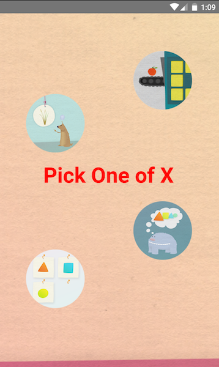
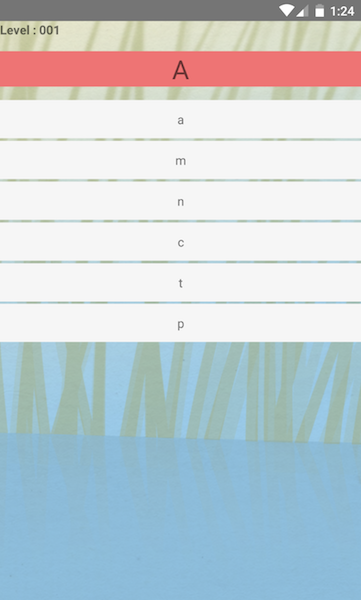
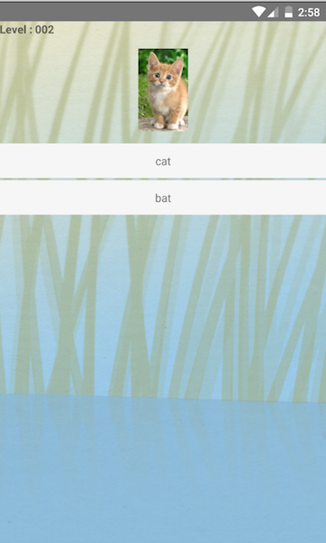
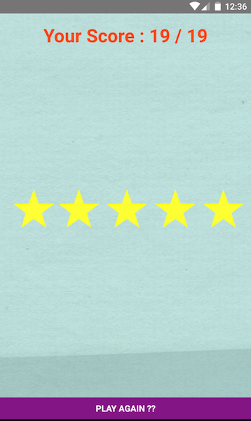

# workshop_pick_one_2
CL-Workshops 5/17 Pick One of X project 2

### Goal/Objective
The goal of the game is is to educate the children with an interaction paradigm. In particular, the different levels in this application will help the children learn the 26 alphabets (lowercase + uppercase letters) along with its pronunciation. It will test the child’s ability to identify a particular stimulus from a number of options.
The various levels in a set will have different difficulties (in terms of number of options). The set of options will always contain one correct option and the rest are foil options. 
Along with identifying the lowercase and uppercase alphabets, the options will also contain image and sound of various words for identification as the level increases. 

### Screenshots

Figure 1. Starting page of the application.   
Figure 2. Level 1 - Easier level with Lowercase/UpperCase letter.  

Figure 3. Difficulty Increased in Level 2 with introduction of Image and more options to choose from.  
Figure 4. On selecting the wrong option, it vanishes from the screen.  
 

Figure 5. Did not get a Good score? Play again will lead to Figure 1.  
Figure 6. On receiving Full Score.  

## Getting Started

### Installing Softwares

* NVM
* React-Native
* React-Native Debugger
* Genymotion
* Atom or Sublime

### JSON File
A JSON file is used to define what letter or word will appear on the different levels. It contains an object list which has a list of all the letters/words along with its respective location (either text, image, sound).It also contains a trial list which contains the data for each level - target word/letter, set of foils and correct word/letter, id, level id and other information specific to level.   

The file is named pick_one.json and is located in the './js'. 

### Image Files
All images of words used in this game is located in the './media' folder.

### Audio Files
All images of words used in this game is located in the './media/sound' folder.

### Style Files
The styles used in the game is found in the './style/styles.js' file.

### Data Collection Functions
This app uses 2 of the 6 functions from Curious Learning Data Collection API
(CuriousLearningDataAPI.js) to collect data so that application usage
can be analyzed. The file is located in the './js/' folder.

1. reportResponse function is used to report the response of the user. In every level it sends the user's answer to a particular question, be it correct or not. It also tracks the amount of time spent to give a response.   

2. reportScore function is used to report performance of the user at the end of the game in terms of the total score scored. This score is a cumulative score of the all the levels.

## History
This project adopted the agile software methodology where the application was created
and modified every 2 weeks from user stories and acceptance criteria.

### Weeks 1 & 2:
In the intial weeks, the goal of the game was defined and application design took place. In the design phase, being in the shoes of the child, and understanding the application from their perspective, the objective of the application was transformed into series of wireframes. After few rounds of reviews of wireframes, a clear picture of the game was established. 
Reading of the JavaScript Content provided by the Team. 

### Weeks 3 & 4:
The hands on coding started in React Native. The base of the game was started to getting built, few of which included render function, styles, layouts and transition from one page to another. 
More reading material was provided. 

### Weeks 5 & 6:
1. The values from JSON file were plugged in as real time data
2. React Native Sound was incorporated.
3. Audio and Visual feedbacks were added

### Weeks 7 & 8:
1. A complete workflow was finished.
2. A small round of usability testing was done and the feedbacks were incorporated.
3. Implemented new suggesstions from the team.

### Weeks 9 & 10:
1. A quantitave system to measure the performance of the user was implemented. The scoring system allowed the user to test their knowledge. 
2. Data Collection API was implemented to allow important information of teh application to be collected - user response, score. 

### Week 11:
1. The SCoring system was improved. 
2. Code clean up
3. The project's README.md file was updated to provide background information to
future developers who are interested in this project.

## Acknowledgements
1. The Curious Learning team for their material, suggestions and guidance
2. [this tutorial](https://facebook.github.io/react-native/docs/tutorial.html)
